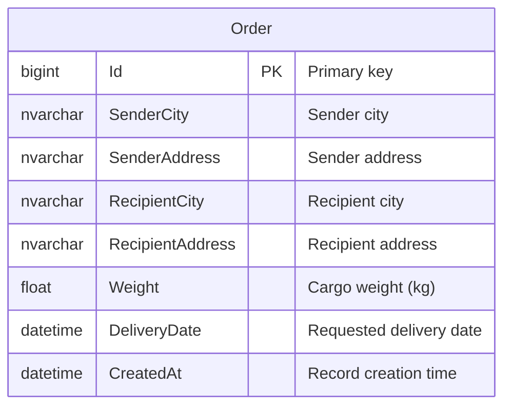

# VerstaIO Appliance

Orders management application: REST API (ASP.NET Core) and React SPA for creating and viewing delivery orders.

---

## API Description

Base URL (development): `http://localhost:5141`

All responses use JSON. Request/response property names are camelCase.

### Endpoints

| Method | Path | Description |
|--------|------|-------------|
| `GET`  | `/api/Orders/GetOrders`     | Returns all orders (array; empty array if none). |
| `GET`  | `/api/Orders/GetOrder/{id}`  | Returns a single order by `id`. Returns 404 if not found. |
| `POST` | `/api/Orders/CreateOrder`   | Creates a new order. Request body: order object (see below). Returns the created order including generated `id`. |

### Order model (request/response)

| Field            | Type   | Description                          |
|------------------|--------|--------------------------------------|
| `id`             | number | Order ID (optional on create).       |
| `senderCity`     | string | Sender city.                          |
| `senderAddress`  | string | Sender address.                      |
| `recipientCity`  | string | Recipient city.                      |
| `recipientAddress` | string | Recipient address.                |
| `weight`         | string | Cargo weight (e.g. `"1.5"`).         |
| `deliveryDate`   | string | Desired delivery date (e.g. `yyyy-MM-dd`). |
| `createdAt`      | string | Creation timestamp (set by server on create). |

### Example requests

**Get all orders**
```http
GET /api/Orders/GetOrders HTTP/1.1
Host: localhost:5141
```

**Get order by ID**
```http
GET /api/Orders/GetOrder/1 HTTP/1.1
Host: localhost:5141
```

**Create order**
```http
POST /api/Orders/CreateOrder HTTP/1.1
Host: localhost:5141
Content-Type: application/json

{
  "senderCity": "Moscow",
  "senderAddress": "Street 1",
  "recipientCity": "SPb",
  "recipientAddress": "Ave 2",
  "weight": "2.5",
  "deliveryDate": "2025-03-15"
}
```

### Health check

- `GET /health` — returns health status (e.g. DB connectivity).

### Swagger

In development, Swagger UI is available at: `https://localhost:<port>/swagger` (or the configured API base URL + `/swagger`).

---

## ER Diagram

The application uses a single main entity: **Order**.



- **Order**: One table `Orders`; no relations to other entities in the current schema.

---

## How to Run

### Prerequisites

- **.NET 8 SDK**
- **SQL Server** (e.g. LocalDB, or full SQL Server instance)
- **Node.js** 18+ and npm (for the frontend)

### 1. Database

Ensure SQL Server (or LocalDB) is running. The API uses this connection string from `VA.Api/appsettings.json`:

```json
"ConnectionStrings": {
  "DefaultConnection": "Server=(localdb)\\MSSQLLocalDB;Database=ordersDb;Trusted_Connection=True;TrustServerCertificate=True;"
}
```

Adjust `Server` and `Database` if you use a different instance or database name.

Create the database and apply migrations (from the solution root):

```bash
cd VA.Api
dotnet ef database update
```

If migrations are not yet created:

```bash
cd VA.Api
dotnet ef migrations add InitialCreate --project ../VA.Infrastructure --startup-project .
dotnet ef database update
```

*(Ensure `VA.Api` is set as startup project and that `VA.Infrastructure` contains the DbContext and entity configuration.)*

### 2. Backend (API)

From the repository root:

```bash
cd VA.Api
dotnet restore
dotnet run
```

The API will listen on the URLs shown in the console (e.g. `http://localhost:5141` and/or `https://localhost:7xxx`). Use the same base URL in the frontend (see below).

### 3. Frontend (React)

From the repository root:

```bash
cd VerstaIOAppliance.UI
npm install
npm start
```

The app will open in the browser (e.g. `http://localhost:3000`). It calls the API using the base URL from the environment variable:

- Create a `.env` file in `VerstaIOAppliance.UI` with:
  ```env
  REACT_APP_API_URL=http://localhost:5141
  ```
  Use the same port/host as your running API (no trailing slash).

### 4. Running everything

1. Start SQL Server (or LocalDB).
2. Apply migrations and start the API (`VA.Api`).
3. Set `REACT_APP_API_URL` and start the UI (`VerstaIOAppliance.UI`).
4. Open the UI in the browser and use “Orders list” and “Create order” as needed.

---

## Solution structure

- **VA.Domain** — Entities and interfaces (e.g. `OrderEntity`, `IOrderRepository`).
- **VA.Application** — Application services (e.g. `OrderService`).
- **VA.Infrastructure** — Data access (EF Core, `ApplicationContext`, `OrderRepository`), DTOs (`OrderModel`), AutoMapper profiles.
- **VA.Api** — ASP.NET Core Web API (controllers, DI, Swagger, health checks, CORS).
- **VerstaIOAppliance.UI** — React SPA (order list, create form, order details).
